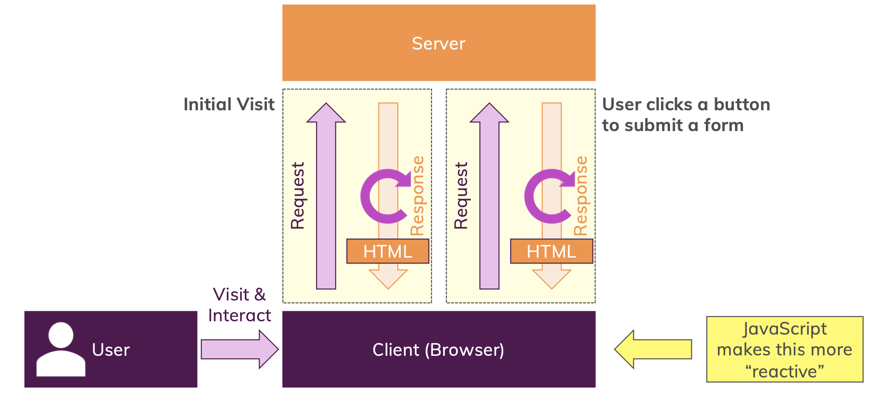

# 섹션1: 개요 강의 내용 정리

### 2. JavaScript란 무엇인가?
> JavaScript는 런타임에 컴파일되는 동적 약형 프로그래밍 언어이다.  
> JavaScript는 웹페이지를 보다 동적으로 만들기 위해 생성되었다.
>
> 브라우저 내에서 페이지의 내용을 직접 변경하기 위해 만들어졌고 최초엔 LiveScript라고 불렸다.  
> 당시 Java의 인기로 인해 Java와의 유사성을 꾀하기 위해 JavaScript로 이름이 변경되었습니다.  
> 하지만, JavaScript는 Java와 완전히 별개로, 이 둘 사이에 전혀 공통정이 없다는 걸 이해하시는 게 중요하다.  
> Java의 대중적 인기로 인해 JavaScript라고 불렸을 뿐이고,
> JavaScript를 만든 사람들이 그 인기에 편승하길 바랬던 것 같습니다.

 

> 웹페이지는 어떻게 작동할까요?  
>
> 여러분이 웹페이지를 방문하는 사용자라고 합시다.  
> 
> 웹페이지를 방문할 때는 브라우저를 사용합니다.  
>
>브라우저가 설치된 클라이언트인 컴퓨터, 노트북을 사용해 URL을 입력하거나 Google의 검색 결과를 클릭해 웹페이지를 로드합니다. 
> 
> 정확히 말하자면, 웹페이지를 처음 방문할 시 요청이 서버로 전송됩니다.
>
> 즉 HTML 파일이 호스팅된 웹페이지가 있는 인터넷의 컴퓨터로 전송이 되면 해당 서버가 그 웹페이지를 로드해 소위 응답이라고 불리는 것을 여러분의 브라우저로 다시 보냅니다.
>
> 우리가 인터넷을 사용해 웹페이지를 방문할 때에 가장 많이 쓰이고, 보고, 사용하는 응답의 형태는 서버에서 클라이언트로 다시 보내진 HTML 페이지입니다.
>
> 예를 들어, 로드된 웹페이지가 온라인 쇼핑몰이다.  
> 사용자는 버튼을 클릭하여 양식을 제출합니다, 가령 제품을 주문하는 등이죠 그러면 이 양식 제출을 서버로 보내기 위해 브라우저에서 서버로의 새로운 요청이 트리거됩니다.  
> 그리고 서버는 들어온 요청을 처리하는데 데이터베이스에 주문 데이터를 저장하는 등의 처리가 되겠죠, 처리가 완료되면 주문 확인 페이지 등의 새로운 웹페이지, 새로운 HTML 문서로 클라이언트로 새로운 응답을 보냅니다.
>
> 우리는 이런 방식으로 웹과 상호작용하죠 웹페이지가 일반적으로 작동하는 방식이죠 그리고 JavaScript는 이 과정을 더욱 반응적으로 만들어 줍니다.  
> 어떤 경우에서는 두 번째 요청에 대한 응답 흐름을 건너뛰어, 이미 로드된 페이지를 변경하고 거기에서 작업을 할 수 있게 해줍니다.
> 
